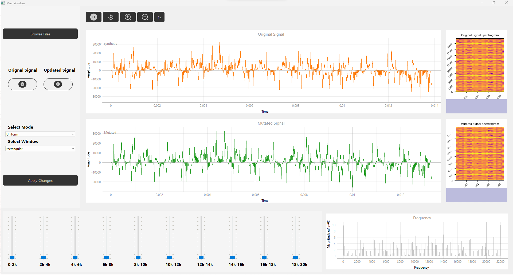
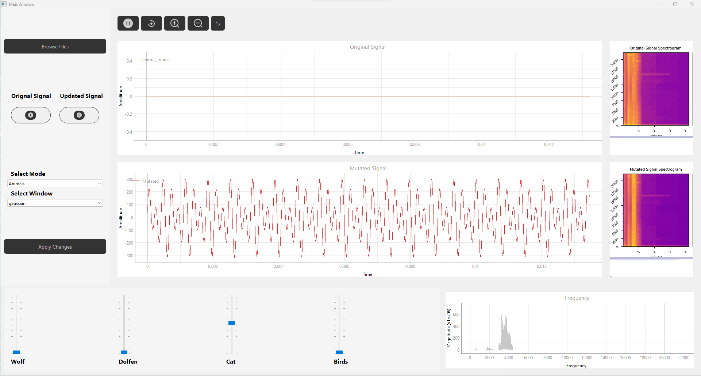
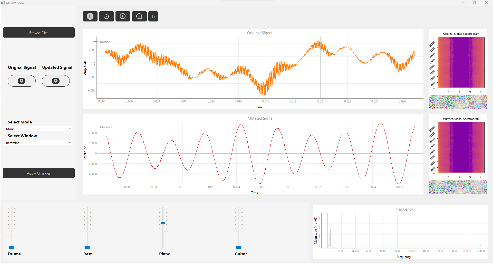
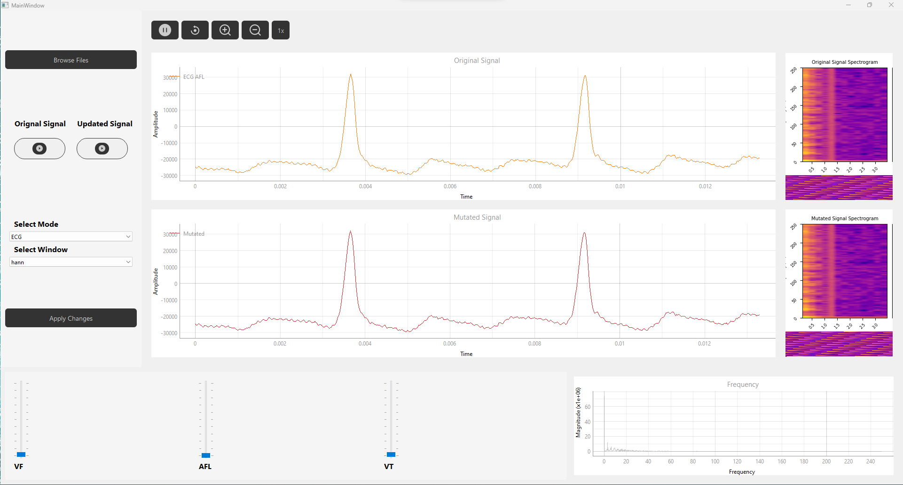
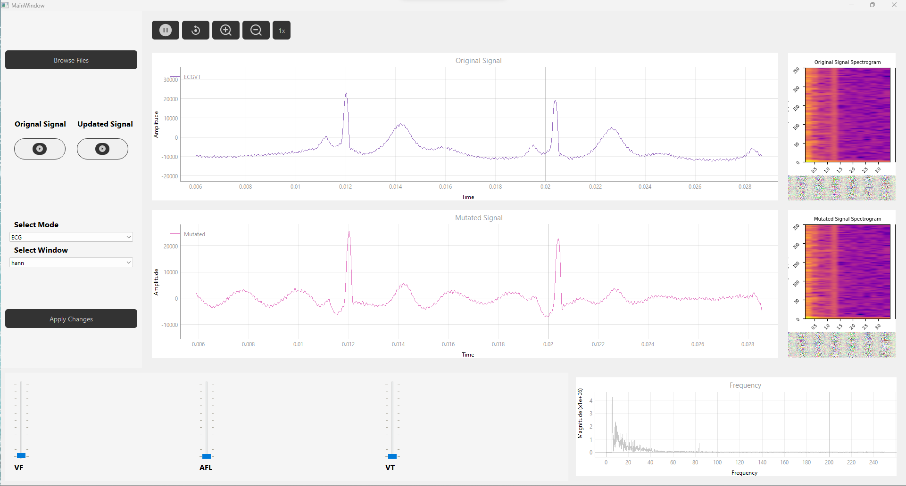

# Aequator
___
Introducing "Aequator" a versatile Signal Equalizer application tailored for signal manipulation and analysis across diverse domains. 
Aequator is a robust desktop tool engineered to cater to music producers, speech analysts, biomedical engineers, and enthusiasts alike. 
This PyQt-powered application empowers users to delve into signal equalization, enabling adjustments to frequency components across distinct modes: 
from Uniform Range Mode, where precise control over frequency segments is granted, to specialized modes like Musical Instruments and Animal Sounds, 
each offering nuanced manipulation for music and sound enthusiasts. 
Additionally, Aequator extends its capabilities to healthcare professionals with the ECG Abnormalities Mode, 
facilitating the exploration and modulation of arrhythmic components within ECG signals for diagnostic and research purposes. 
Whether enhancing music compositions, exploring animal sounds, or dissecting biomedical signals, Aequator
stands as a comprehensive and user-friendly solution for signal equalization and analysis.  

## Table of contents
___
- [Introduction](#introduction)
- [Features](#features)
- [Getting Started](#getting-started)
- [User Interface](#user-interface)
- [Usage](#usage)
- [Screenshots](#screenshots)
- [Contributors](#contributors)


## Introduction
___
Signal equalization and manipulation play a pivotal role across various domains, from audio engineering to biomedical research. 
Aequator emerges as an indispensable tool catering to a spectrum of users seeking to control and fine-tune signal frequencies with precision. 
Crafted using PyQt, Aequator is a cutting-edge application designed to streamline signal equalization processes, 
offering a user-friendly interface for effortless frequency component adjustments. 
Whether exploring musical compositions, analyzing animal sounds, or dissecting biomedical signals with a focus on arrhythmic anomalies, 
Aequator stands as a versatile solution tailored for intuitive signal manipulation and analysis across diverse fields.

## Features
___
### 1. Mode Selection:

- Uniform Range Mode: Divide signal frequencies into equal ranges for manipulation.
- Musical Instruments Mode: Customize magnitudes of individual musical instruments in mixed signals.
- Animal Sounds Mode: Adjust specific animal sound magnitudes in mixed audio signals.
- ECG Abnormalities Mode: Control arrhythmic components in ECG signals for diagnostic analysis.   

### 2. Frequency Component Control:

- Sliders for precise manipulation of frequency components.
- Real-time adjustments reflected in linked signal viewers and spectrograms.   

### 3. Multiplication/Smoothing Windows:

- Options for multiplying frequencies with different smoothing windows (Rectangle, Hamming, Hanning, Gaussian).
- mUser customization of window parameters.

### 4. Interactive Signal Viewers:

- Two synchronized cine signal viewers (input and output) with full functionality (playback, zoom, pan, speed control).
- Linked viewers for synchronous display of time and magnitude in signals.   

### 5. Spectrogram Visualization:

- Display spectrograms for input and output signals.
- Toggle option for displaying/hiding spectrograms.   

### 6. User Interface (UI) Enhancements:

- Intuitive mode switcher for seamless transition between different signal manipulation modes.
- Minimal UI changes between modes, ensuring a consistent and user-friendly interface.   

### 7. Custom Synthetic Signal Validation:

- Capability to prepare synthetic signals for validation of equalizer functionality.
- Summation of pure single frequencies across the frequency range for tracking individual frequency manipulations.   

### 8. Application Flexibility:

- Adaptability to diverse fields including music production, speech analysis, and biomedical signal exploration.
- Robust platform for real-time signal equalization and comprehensive analysis.   

### 9. PyQt-based Design:

- Utilization of PyQt for a robust and user-friendly desktop application.
- User-centric interface for seamless interaction and efficient signal manipulation.   

### 10. Customization and Control:

- Provide options to fine-tune frequency components for precise signal adjustments.
- Streamlined user controls for easy customization and modification of signal characteristics.   

___
## Getting Started
1. Clone the repo to your local machine with
2. Install the necessary dependencies (PyQt, etc.) if not already installed.
3. Run the app using ```Python main.py```
4. Select a signal Equalization mode, Upload your signal and start exploring.
___

## User Interface:
___

1. Mode Switcher: 
    - A mode switcher enables effortless transition between different operational modes (Uniform Range, 
        Musical Instruments, Animal Sounds, ECG Abnormalities) with ease.   

2. Slider Controls:   
   - Intuitive sliders facilitate precise manipulation of frequency components within the selected mode, offering real-time adjustments.

3. Synchronized Signal Viewers:
    - Two linked cine signal viewers (input and output) provide comprehensive visualization of signals, 
      ensuring synchronous display of time and magnitude for accurate analysis.

4. Spectrogram Display:
    - Toggle functionality allows users to view or hide spectrograms for both input and output signals, 
      facilitating visual insights into signal changes.   

## Usage
___
Employing Aequator for signal manipulation and analysis is an uncomplicated process:

1. Select Operational Mode:
   - Choose the desired operational mode (Uniform Range, Musical Instruments, Animal Sounds, ECG Abnormalities) 
     based on your signal manipulation requirements.

2. Adjust Frequency Components:
   - Utilize the intuitive sliders to customize the magnitudes of frequency components within the selected mode.  

3. Real-time Signal Visualization:
    - Observe signal modifications in real-time through synchronized cine signal viewers, 
      showcasing changes in both input and output signals simultaneously.

4. Explore and Analyze:
    - Load your specific synthetic or real signal data to explore the effects of equalization and analyze signal modifications.   

5. Interact with Signals:
    - Utilize playback controls (play/pause), adjust speed, and navigate through the signals for detailed analysis and observation.  

## Screenshots
___
Here are some screenshots of the Aequator application in action:


_Uniform mode_


_A signal of animals after manipulation_


_A signal of musical instruments after manipulation_


_An ECG signal with AFL Arrhythmia before and after filtration_


_An ECG signal with VT Arrhythmia before and after filtration_

Feel free to explore the application and discover its full potential for medical signal analysis.

## Contributors
___

We would like to acknowledge the following individuals for their contributions to the research:

<table>
  <tr>
    <td align="center">
    <a href="https://github.com/Bodykudo" target="_black">
    
    <br />
    <sub><b>Abdallah Magdy</b></sub></a>
    <td align="center">
    <a href="https://github.com/abduelrahmanemad" target="_black">
    
    <br />
    <sub><b>Abdelrahman Emad</b></sub></a>
    </td>
    </td>
    <td align="center">
    <a href="https://github.com/MohamedAlaaAli" target="_black">
    
    <br />
    <sub><b>Mohamed Alaa</b></sub></a>
    </td>
    <td align="center">
   <td align="">
    <a href="https://github.com/Medo072" target="_black">
    
    <br />
    <sub><b>Mohamed Ibrahim</b></sub></a>
    </td>
    </tr>
 </table>

---
We are confident that Aequator will prove to be an indispensable asset for music producers, speech analysts, biomedical engineers, and enthusiasts alike in their pursuit of precise signal manipulation and analysis across diverse domains. Should you have any inquiries or face any challenges while using Aequator, please feel free to contact us for assistance or clarification.
Wishing you a productive and fulfilling experience exploring the world of signal manipulation and analysis with Aequator!


